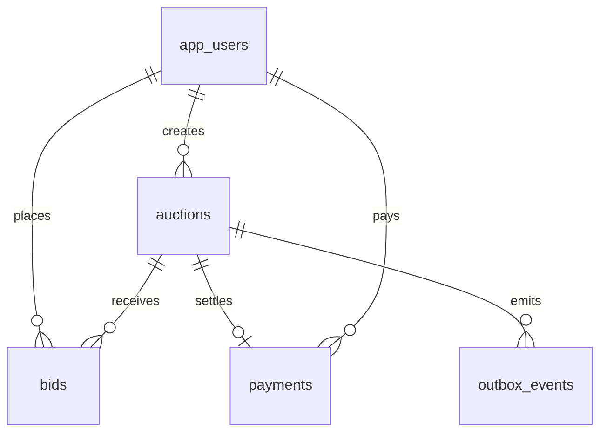

# Database design

BidSphere uses PostgreSQL as the system of record. Redis coordinates short-lived
bid locks, while Kafka distributes changes; neither is authoritative for auction
or payment state.

## Core model

`auctions.current_price` and `current_bid_id` are a read-optimized projection
of the accepted bid history. A bid is append-only. Bid processing must acquire
the Redis auction lock, re-read the auction row, validate that the new amount is
greater than its current price, insert the bid, update the projection, and write
an outbox event in the same PostgreSQL transaction. The `version` column makes
the update optimistic as a final safety net if a lock is lost or bypassed.

All money is stored as `numeric(19,4)`—never floating point. Timestamps use
`timestamptz` and are recorded in UTC.

## Lifecycle values

* Auction: `DRAFT`, `SCHEDULED`, `LIVE`, `ENDED`, `CANCELLED`, `SETTLED`
* Payment: `PENDING`, `PROCESSING`, `SUCCEEDED`, `FAILED`, `REFUNDED`, `CANCELLED`
* Outbox event: `PENDING`, `PUBLISHED`, `FAILED`

The initial production schema is in
`bidsphere-backend/src/main/resources/db/migration/V1__create_core_schema.sql`.
It includes an outbox for atomic database-to-Kafka publishing and a
`processed_events` inbox for idempotent Kafka consumers.

## Deliberate boundaries

Authentication credentials and payment-provider tokens are excluded from this
schema. They belong in an identity provider and a payment processor; only the
provider references needed for reconciliation are persisted here.
